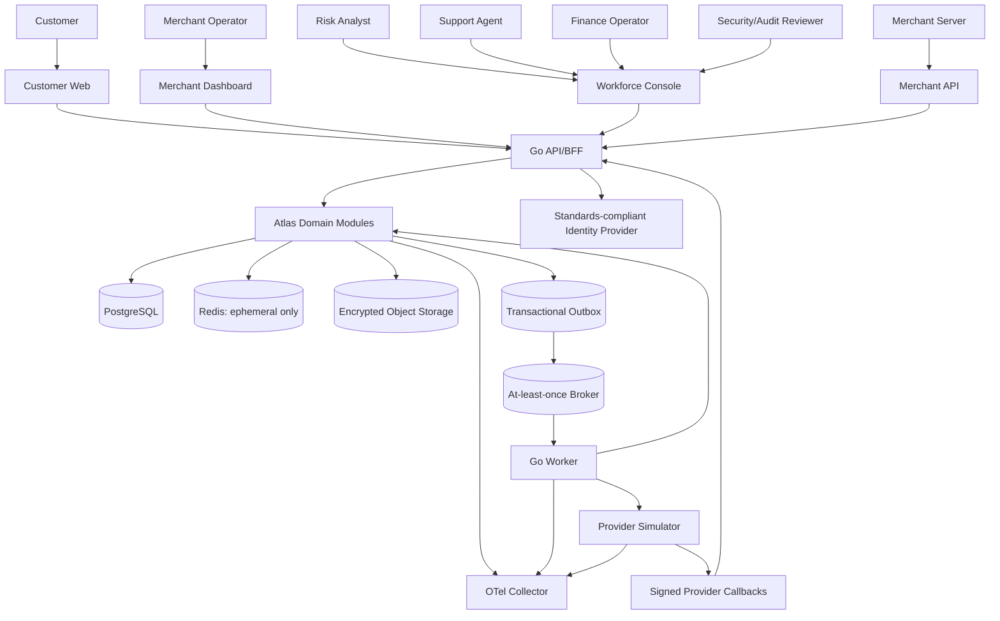

# System architecture

## 1. Architecture objective

Atlas must preserve financial correctness and auditability while remaining understandable to one engineer and reviewable by hiring teams. The reference architecture is therefore a **modular monolith with explicit bounded contexts**, a single authoritative PostgreSQL cluster, and independently deployable API, worker, and provider-simulator processes.

This choice demonstrates judgement: transactions that must be atomic remain local, while asynchronous boundaries and future extraction points are modelled deliberately.

## 2. System context

## 3. Deployable units

### `api`

Responsibilities:

- BFF session boundary for browser clients;
- public merchant API;
- customer, merchant, and workforce request handling;
- authorization and step-up enforcement;
- synchronous commands and reads;
- idempotency ownership;
- audit creation for request-driven security events;
- health/readiness endpoints.

It must not:

- run unbounded jobs;
- call slow providers inside a database transaction;
- publish directly to the broker before the database commit;
- expose database models as API contracts.

### `worker`

Responsibilities:

- outbox relay;
- inbox-protected event consumers;
- provider submission and polling;
- webhook delivery and retry;
- hold expiry;
- reconciliation;
- statement generation;
- periodic balance verification;
- watchdogs for stuck workflows;
- audit-manifest signing and archival.

### `provider-simulator`

Responsibilities:

- deterministic bank/payment provider behaviour;
- configurable latency, timeout, duplicate, delayed, out-of-order, malformed, and inconsistent responses;
- signed callbacks;
- settlement-file generation;
- reconciliation mismatch injection;
- immutable scenario IDs for reproducibility.

The simulator is a first-class engineering asset, not a mock hidden inside unit tests.

### `web`

One React + TypeScript application may host customer, merchant, and workforce shells with separate route trees and authorization boundaries. Separate bundles are optional. Separation of identity realms, permissions, data-fetching clients, and UI capabilities is mandatory.

## 4. Bounded contexts

| Context | Owns | Does not own |
|---|---|---|
| Identity | application principals, role bindings, sessions metadata, step-up state | password or passkey verification internals |
| Customer | profile, contact points, KYC state, consent, restrictions | ledger balances |
| Ledger | chart of accounts, journals, postings, financial balance projection | customer UI transaction labels |
| Wallet | wallet lifecycle, holds, spendability rules | immutable accounting rules |
| Risk | policies, rules, limits, decisions, factors | final ledger posting |
| Transfer | internal and external transfer state machines | provider implementation details |
| Payment | payment intents, attempts, refunds | settlement file parsing |
| Provider | provider adapters, requests, callbacks, external references | customer-facing product semantics |
| Settlement | settlement batches and obligations | risk case decisions |
| Reconciliation | imports, matches, exceptions, resolution | original ledger mutation |
| Operations | cases, notes, approvals, work queues | direct unrestricted database mutation |
| Reporting | statements, exports, trial balance views | source-of-truth financial writes |
| Audit | immutable security and business-control evidence | operational notes as mutable source truth |

## 5. Internal module contract rules

- Modules expose commands, queries, and domain events, not tables.
- Cross-module writes occur through application services, not direct SQL against another module’s tables.
- Ledger posting is accessible only through a narrow posting interface with typed templates.
- Authorization is enforced at the application boundary and rechecked at sensitive domain services.
- Each module owns its migrations, but all migrations are ordered in one repository.
- Shared code is limited to primitives: identifiers, money, clock, transaction wrapper, audit context, error vocabulary, tracing, and test fixtures.
- “Common” must not become a dumping ground for domain logic.

## 6. Synchronous and asynchronous boundaries

### Synchronous when

- the caller requires an immediate authorization decision;
- a balance reservation and command acceptance must be atomic;
- a journal and balance projection must commit together;
- returning an identifier and durable accepted state is necessary.

### Asynchronous when

- calling a provider;
- delivering merchant webhooks;
- generating statements or exports;
- reconciliation and large imports;
- sending notifications;
- executing retries and watchdogs;
- generating audit manifests.

A synchronous API may return `202 Accepted` only after the command, reservation, state transition, audit record, and outbox message are durably committed.

## 7. Data stores

### PostgreSQL

Source of truth for:

- ledger and balances;
- identity mappings and authorization grants;
- customer and merchant state;
- transfers, payments, refunds, settlement, reconciliation;
- idempotency, inbox, outbox, jobs, audit metadata.

Rules:

- ledger and spendability mutations use explicit SQL transactions;
- the ledger write path does not depend on an ORM unit-of-work abstraction;
- unique and check constraints enforce business invariants where possible;
- row-level security may be defense in depth, but application authorization remains mandatory;
- database roles separate migration, application write, read-only analytics, worker, and break-glass access.

### Redis

Permitted uses:

- rate-limit counters;
- short-lived distributed locks where loss does not corrupt money;
- ephemeral session acceleration if durable session truth remains elsewhere;
- cached reference data;
- non-authoritative presence or notification hints.

Forbidden uses:

- wallet balance;
- idempotency source of truth;
- ledger sequence;
- final authorization grant;
- durable job state without recovery.

### Object storage

- raw provider settlement files;
- generated statements;
- synthetic KYC evidence;
- exports;
- signed audit manifests;
- test and performance reports.

Objects use immutable keys, checksums, retention metadata, encryption, and access through short-lived authorized URLs or server-side streaming.

## 8. Architecture characteristics

| Characteristic | Target design response |
|---|---|
| Correctness | local ACID transaction for journals, balances, commands, idempotency, and outbox |
| Security | BFF, separate identities, least privilege, step-up, maker-checker, encryption, audit |
| Recoverability | explicit state machines, watchdogs, retry safety, PITR, restore exercises |
| Auditability | append-only financial history, immutable audit events, correlation and evidence |
| Evolvability | bounded modules, contract versioning, ADRs, migration discipline |
| Operability | role-specific consoles, metrics, traces, DLQs, runbooks, reconciliation |
| Performance | synchronously maintained balance projection, cursor pagination, bounded queries |

## 9. Scale posture

Atlas must publish measured performance only. The architecture should support horizontal API and worker replicas, but tests must declare:

- hardware and container limits;
- dataset size and cardinality;
- workload mix;
- connection pool settings;
- latency percentiles;
- error rate;
- ledger and reconciliation invariant checks after the run.

Do not claim “millions of transactions” from an empty-table benchmark.
