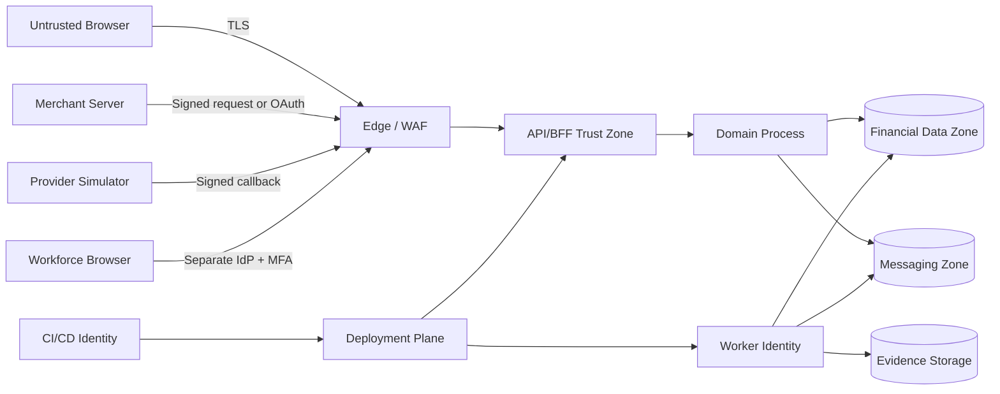

# Security and trust model

## 1. Security posture

Atlas treats security as the foundation of each capability, not a final hardening sprint. The target is a verifiable control system aligned to current secure-development, application-security, API-security, digital-identity, financial-grade API, incident-response, privacy, and payment-data guidance.

Alignment is not certification.

## 2. High-value assets

1. Ledger journals, postings, and balance projections.
2. Idempotency, inbox, outbox, and workflow state.
3. Customer identity mappings, contact data, and synthetic KYC evidence.
4. Merchant credentials, webhook signing keys, and provider credentials.
5. Workforce roles, approvals, and privileged-action audit history.
6. Provider statements, reconciliation decisions, settlement close records.
7. Encryption keys, signing keys, CI/CD credentials, infrastructure state.
8. Logs, traces, exports, statements, and backups that may contain sensitive metadata.

## 3. Trust boundaries

Every boundary must document authentication, authorization, confidentiality, integrity, replay resistance, rate limits, logging, and failure behaviour.

## 4. Identity populations

### Customer identity

- OIDC authorization-code flow through BFF.
- Phishing-resistant authenticators preferred; MFA and recovery are owned by the IdP.
- Session uses `Secure`, `HttpOnly`, restricted `SameSite`, narrow path/domain, rotation, idle timeout, and absolute timeout.
- Sensitive actions require fresh step-up and transaction confirmation.

### Merchant workforce identity

- Separate organization-scoped role bindings.
- Merchant roles cannot access platform workforce APIs.
- Invitations expire, are single-use, and require verified identity.

### Platform workforce identity

- Separate identity realm or client.
- Phishing-resistant MFA is mandatory for privileged roles.
- No shared accounts.
- Short session lifetime, step-up, device and network policy hooks.
- Break-glass role is disabled by default, time-bounded, reasoned, alerted, and reviewed.

### Machine identity

- Provider adapters, workers, deployment jobs, and merchant clients have distinct credentials and scopes.
- Credentials are non-human, rotatable, and environment-specific.
- No long-lived universal “service key.”

## 5. Authorization model

Atlas uses layered RBAC plus resource and context checks.

A decision evaluates:

- principal type and subject;
- tenant or organization;
- role and permission;
- resource owner and classification;
- action sensitivity;
- KYC tier and account restriction;
- step-up freshness;
- maker-checker separation;
- environment and, where appropriate, trusted-device or network posture.

### Mandatory properties

- deny by default;
- every list query includes tenant and visibility constraints;
- every object read revalidates resource ownership or explicit grant;
- field-level masking is server-driven;
- UI hiding is never authorization;
- permission changes are audited and invalidate relevant sessions or cached decisions;
- checker cannot approve own action;
- support cannot perform finance actions;
- finance cannot edit risk evidence;
- risk cannot post ledger corrections directly.

## 6. Authentication and session controls

- Tokens are not stored in browser-readable persistence.
- CSRF protection is mandatory for cookie-authenticated mutations.
- OIDC state, nonce, PKCE, issuer, audience, and redirect URI are validated.
- Session fixation is prevented through rotation at authentication and privilege change.
- Logout invalidates the server session and clears browser state; browser back-forward cache behaviour is tested.
- Recovery, email change, phone change, beneficiary creation, API-key creation, payout, refund, restriction removal, and privileged exports trigger risk or step-up controls.
- Error responses avoid account enumeration.

## 7. API security controls

- Explicit schema validation and unknown-field rejection for mutation payloads.
- Object-level and property-level authorization.
- Per-principal, per-IP, per-tenant, and operation-weighted rate limits.
- Request body, header, decompression, pagination, export, and query complexity limits.
- Idempotency on all money-moving mutations.
- Stable error taxonomy using problem details.
- Request IDs and trace context without embedding PII.
- CORS allowlist; no wildcard with credentials.
- HSTS, CSP, frame restrictions, referrer policy, MIME protections, and secure cache headers.
- Separate public, customer, merchant, and workforce route groups.

## 8. Webhook and callback security

### Inbound provider callbacks

- Verify signature over exact raw body plus timestamp and unique event identifier.
- Enforce timestamp tolerance and event replay storage.
- Validate key ID and support rotation.
- Reject oversized, malformed, unsupported-version, or content-type-confused payloads.
- Persist raw payload checksum and normalized event separately.
- Never trust callback status without matching provider, account, amount, currency, and external reference.

### Outbound merchant webhooks

- Per-endpoint signing secret or asymmetric public-key model.
- Secret shown once and stored encrypted.
- Include delivery ID, event ID, timestamp, signature version, key ID, and canonical signed bytes.
- Retries reuse the same event ID and use a new delivery attempt ID.
- Endpoint validation blocks localhost, link-local, private, metadata-service, and disallowed schemes.
- Resolve DNS safely and defend against rebinding.
- Limit redirects, response size, timeout, connection reuse, and TLS policy.
- Replay tooling is permissioned and audited.

## 9. Data protection

### Classification

| Class | Examples | Minimum handling |
|---|---|---|
| Public | published docs | integrity controls |
| Internal | feature flags, non-sensitive config | authenticated access |
| Confidential | merchant configuration, operational notes | encryption, least privilege, audit |
| Sensitive personal | contact data, identifiers, KYC metadata | field encryption, masking, retention, access review |
| Financial control | journals, balances, reconciliation decisions | immutability, dual control, backup, integrity verification |
| Secret | signing keys, client secrets, session keys | KMS/HSM abstraction, rotation, no logging |

### Rules

- Collect only fields with documented purpose.
- Encrypt sensitive fields using envelope encryption where database-level encryption is insufficient.
- Use deterministic lookup tokens only when necessary and separate them from ciphertext.
- Never log secrets or raw sensitive documents.
- Use synthetic identities in all demos, screenshots, traces, fixtures, and content.
- Restrict exports, watermark them with actor and timestamp, and protect against CSV formula injection.
- Backups inherit data classification and retention.

## 10. Cryptography and key management

- TLS is required for all non-local traffic.
- Use platform cryptographic libraries and modern approved algorithms.
- Keys have purpose, owner, algorithm, version, activation, expiry, rotation, revocation, and destruction metadata.
- Encryption and signing keys are distinct.
- Environments never share keys.
- Key rotation is tested while old data and in-flight webhook signatures remain verifiable during a defined grace period.
- Application code references key identifiers, not raw key material.
- Local development uses disposable development keys clearly separated from release evidence.

## 11. Secure software supply chain

CI MUST perform:

- formatting, linting, type checking, and tests;
- Go vulnerability analysis;
- dependency vulnerability and license checks;
- secret scanning including history and test fixtures;
- SAST and Semgrep-like policy checks;
- container and IaC scanning;
- OpenAPI/AsyncAPI lint and breaking-change checks;
- migration safety checks;
- SBOM generation;
- signed artifacts and build provenance;
- branch protection and required review for high-risk paths.

The ledger, authorization, cryptography, migrations, CI workflow, and deployment manifests use code-owner review.

## 12. Threat modelling method

Use data-flow diagrams plus STRIDE for security threats and LINDDUN-style privacy questions for sensitive workflows.

Each threat record includes:

- asset and attacker;
- entry point and preconditions;
- abuse story;
- business impact;
- preventive, detective, and recovery controls;
- verification test;
- residual risk and owner.

Threat models are revisited when a trust boundary, identity population, provider, data class, or privileged action changes.

## 13. Security incident readiness

Minimum runbooks:

- suspected account takeover;
- leaked merchant API key;
- leaked webhook signing key;
- privileged misuse;
- ledger integrity alert;
- reconciliation spike;
- data exposure in logs or export;
- malicious webhook endpoint;
- dependency or build compromise;
- backup corruption;
- provider callback-signature failure surge.

Each exercise must record detection source, containment, customer and financial impact analysis, evidence preservation, recovery, notification decision, and corrective actions.

## 14. Security acceptance statement

A phase cannot be called secure because automated scanners pass. It requires architecture controls, adversarial tests, manual review, operational detection, and recovery evidence.
