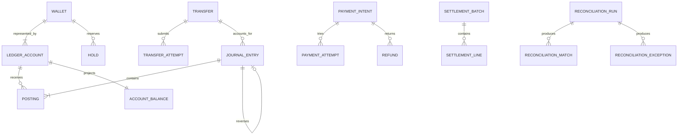

# Data architecture and ledger model

## 1. Financial model

Atlas maintains a platform general ledger. Customer wallet balances are liabilities owed by Atlas to customers. Funds held at a simulated provider or settlement bank are platform assets. Fees are revenue. Provider charges are expenses. Clearing and suspense accounts bridge lifecycle stages.

Every ledger account is single-currency.

## 2. Core entities



## 3. Tables and critical fields

### `ledger_accounts`

- `id` opaque time-sortable identifier;
- `tenant_id`;
- `code` stable unique account code;
- `name`;
- `account_class` asset/liability/equity/revenue/expense;
- `normal_side` debit/credit;
- `currency`;
- `owner_type` platform/customer/merchant/provider;
- `owner_id` nullable for platform accounts;
- `status` active/frozen/closed;
- `allow_negative` explicit;
- `created_at`, `closed_at`;
- immutable accounting attributes after first posting.

### `journal_entries`

- `id`;
- `tenant_id`;
- `journal_type`;
- `business_reference_type` and `business_reference_id`;
- `idempotency_scope` and unique `idempotency_key` where applicable;
- `effective_at`, `posted_at`, `created_at`;
- `description_code` and structured metadata;
- `reversal_of_journal_id`;
- `status` draft/posted is permitted only if drafts are never reflected in balances; production write path SHOULD create posted journals atomically;
- `sequence_number` monotonic per ledger partition if required for statements;
- `created_by_actor_id` or system principal;
- `correlation_id`, `causation_id`.

### `postings`

- `id`;
- `journal_entry_id`;
- `ledger_account_id`;
- `side` debit/credit;
- `amount_minor` positive integer;
- `currency` duplicated for constraint and query safety;
- `memo` structured code, not arbitrary PII;
- `created_at`.

### `account_balances`

- `ledger_account_id`;
- `posted_debit_minor`;
- `posted_credit_minor`;
- `posted_net_minor` or side-aware fields;
- `held_minor` for spendable customer liability accounts;
- `available_minor` derived and stored synchronously;
- `version` optimistic concurrency token;
- `last_journal_sequence`;
- `updated_at`.

This table is a projection, not an independent source of truth. It is updated in the same transaction as journals or holds and is periodically recomputed.

### `holds`

- `id`, `wallet_id`, `ledger_account_id`;
- `purpose_type`, `purpose_id`;
- `original_amount_minor`, `remaining_amount_minor`, `currency`;
- `state` active/partially_captured/captured/released/expired;
- `expires_at`;
- `version`;
- `created_at`, `updated_at`;
- unique active purpose constraints.

## 4. Database invariants

The database and posting function MUST enforce:

- at least two postings per committed journal;
- every posting amount is greater than zero;
- every posting currency equals account currency;
- debit sum equals credit sum per journal and currency;
- journal business reference uniqueness where the business operation is unique;
- only active accounts receive new postings;
- posted rows cannot be updated or deleted by application roles;
- reversal references an existing posted journal and cannot be duplicated;
- no journal can reverse itself;
- customer balance projection cannot pass configured overdraft policy;
- hold amount cannot exceed remaining active amount;
- capture plus release cannot exceed original hold;
- closed periods reject backdated writes except through an explicit adjustment workflow.

Some aggregate invariants require a stored procedure or controlled posting service because SQL check constraints cannot compare arbitrary child-row sums at commit. The implementation must still use database permissions and constraints to prevent bypass.

## 5. Posting transaction

The canonical posting transaction:

1. Resolve an existing idempotency record or reserve the idempotency key.
2. Lock affected balance rows in deterministic account order.
3. Validate account status, currency, limits, and expected versions.
4. Insert journal entry.
5. Insert all postings.
6. Validate balanced totals.
7. Update account balance projections.
8. Update or capture related hold when applicable.
9. Transition the business object.
10. Insert audit record.
11. Insert outbox event.
12. Store idempotent response metadata.
13. Commit.

External calls never occur inside this transaction.

## 6. Concurrency strategy

- Lock balance rows in stable account-ID order to reduce deadlocks.
- Use serializable transactions or explicit row locks for spendability-critical workflows, selected by ADR and measured contention.
- Retry serialization failures with bounded jitter and a fresh transaction.
- Unique constraints are the final defense for idempotency and duplicate business references.
- Test concurrent transfers against the same source, reciprocal transfers, same-key retries, and deadlock-prone account ordering.

## 7. Balance semantics

For a customer liability account whose normal balance is credit:

```text
posted_balance = total_credits - total_debits
available_balance = posted_balance - active_holds
```

The API returns:

- `posted`;
- `held`;
- `available`;
- `as_of` timestamp;
- projection sequence/version.

It must not return a single unexplained “balance.”

## 8. Accounting templates

### Internal wallet transfer

Customer A transfers NGN 10,000 to Customer B.

| Account | Debit | Credit |
|---|---:|---:|
| Customer A wallet liability | 10,000 | 0 |
| Customer B wallet liability | 0 | 10,000 |

### Simulated cash-in confirmation

| Account | Debit | Credit |
|---|---:|---:|
| Provider settlement receivable asset | 10,000 | 0 |
| Customer wallet liability | 0 | 10,000 |

At settlement:

| Account | Debit | Credit |
|---|---:|---:|
| Settlement bank asset | 10,000 | 0 |
| Provider settlement receivable asset | 0 | 10,000 |

### External payout with fee

For NGN 10,000 payout and NGN 100 fee:

| Account | Debit | Credit |
|---|---:|---:|
| Customer wallet liability | 10,100 | 0 |
| Provider payout payable/clearing | 0 | 10,000 |
| Fee revenue | 0 | 100 |

Provider settlement may then debit clearing/payable and credit settlement bank asset according to the simulator’s economic model.

### Refund

A refund is a new business operation with its own journal and references. It does not mutate the original payment journal.

## 9. FX model

- Quote includes source currency, destination currency, source amount, destination amount, rate, spread, rounding mode, expiry, and quote version.
- Client confirms quote ID, not a floating-point rate.
- Each currency is balanced in its own journal.
- FX bridge/clearing accounts connect the linked journals economically.
- Expired quotes cannot be silently repriced.
- Rounding differences post to an explicit rounding account.
- Tests cover currency exponents, half-way rounding, maximum amounts, and repeated partial refunds.

## 10. Rebuild and verification

A verification job must:

- recompute each account from postings;
- recompute active held amount from holds;
- compare projected and recomputed values;
- identify first divergent sequence;
- emit a critical alert on non-zero unexplained variance;
- never auto-repair financial data silently;
- produce a signed, immutable verification report.

## 11. Audit integrity

Financial tables are protected primarily by append-only permissions, constraints, backups, and reconciliation. An additional tamper-evident audit chain may hash canonical audit events into batches and sign daily roots with a managed signing key. It is defense in depth, not a substitute for database controls.
