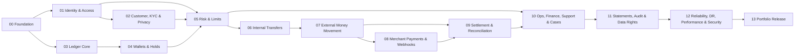

# Roadmap and dependencies

## Delivery model

The phases are capability gates, not calendar promises. Do not start the next money-moving phase until the previous phase’s invariants and failure tests pass.



## Phase sequence

| Phase | Core outcome | Hard dependency | Evidence gate |
|---|---|---|---|
| 00 | Reproducible secure engineering platform | None | CI, environments, threat model, signed build, restore baseline |
| 01 | Separated customer, merchant, workforce, and machine access | 00 | Auth matrix, BOLA tests, step-up demo |
| 02 | Privacy-aware customer lifecycle and synthetic KYC | 01 | DPIA, retention map, KYC state tests |
| 03 | Immutable balanced journal | 00 | property, database, concurrency, and recomputation tests |
| 04 | Correct available balances and reservations | 03 | double-spend and expiry tests |
| 05 | Explainable deterministic transaction controls | 01, 02, 04 | versioned policy and race tests |
| 06 | Atomic internal transfers | 04, 05 | duplicate, concurrent, timeout-after-commit tests |
| 07 | Recoverable external transfer orchestration | 06 | ambiguous provider and out-of-order callback tests |
| 08 | Secure merchant API and webhook platform | 01, 07 | signature, key rotation, SSRF, replay tests |
| 09 | Settlement and deterministic reconciliation | 07, 08 | rerun, mismatch, duplicate, close/reopen tests |
| 10 | Audited role-specific operations | 05, 09 | maker-checker, masked data, abuse-case tests |
| 11 | Statements, reports, audit proof, and data rights | 09, 10 | period boundaries, export safety, tamper checks |
| 12 | Recovery and verification under stress | all prior | restore, chaos, load, penetration checklist |
| 13 | Reviewer-ready evidence and narrative | 12 | reproducible demo, docs, claims ledger |

## Parallel work permitted

- Frontend design system and accessibility harness may proceed during Phase 00.
- Ledger documentation and accounting examples may proceed while identity integration is built.
- Provider simulator can be designed during Phase 04 but cannot be integrated until internal transfer invariants pass.
- Content drafts may be written at any time, but publication must wait for implementation evidence.

## Work that must not be parallelised prematurely

- External transfers before wallet hold correctness.
- Merchant refunds before payment and settlement state machines are stable.
- Reconciliation before immutable external files and internal references exist.
- Operations mutations before workforce authorization and audit are complete.
- Performance optimisation before correctness and observability baselines exist.

## Recommended repository shape

```text
atlas/
  apps/
    web/                     # React application
  cmd/
    api/                     # Go HTTP/BFF/API process
    worker/                  # Outbox, provider, reconciliation, report jobs
    simulator/               # Deterministic external provider simulator
  internal/
    identity/
    customer/
    ledger/
    wallet/
    risk/
    transfer/
    payment/
    provider/
    settlement/
    reconciliation/
    operations/
    reporting/
    audit/
    platform/
  contracts/
    openapi/
    asyncapi/
    provider-fixtures/
  migrations/
  tests/
    integration/
    contract/
    chaos/
    performance/
    security/
  docs/
    prd/
    adr/
    threat-models/
    runbooks/
    evidence/
  deploy/
    local/
    staging/
    production-reference/
```

## Architectural extraction criteria

A module may become a separate service only if one or more are demonstrated:

- materially different scaling profile;
- strict security or data-isolation boundary;
- independent deployment frequency with unacceptable coupling;
- separate availability requirement;
- independent ownership team;
- database contention that cannot be solved safely within the current architecture.

The ADR must also document new distributed failure modes, operational cost, data ownership, event contracts, and migration strategy.
