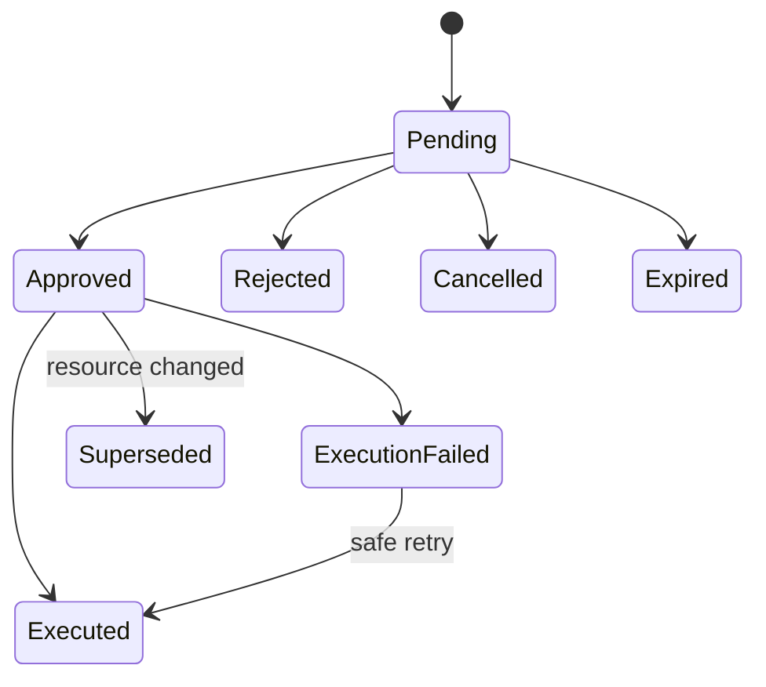

# Phase 01 — Identity, access, tenancy, and privileged workforce controls

## Outcome

Establish separate identity populations and enforce secure browser sessions, tenant isolation, least privilege, step-up authentication, machine credentials, approvals, and auditable access decisions.

## Why this phase is high-signal

Fintech security failures often involve broken object authorization, overpowered staff tools, credential leakage, weak recovery, and confused identity boundaries. This phase proves the application can answer **who**, **for which tenant**, **under what assurance**, **with which permission**, and **why** for every sensitive action.

## Dependencies

Phase 00.

## Identity architecture

### Customer identities

- External standards-compliant IdP.
- OIDC authorization code through BFF.
- Server-side session; browser receives only opaque secure session cookie.
- Customer principal maps to one customer profile.

### Merchant identities

- Merchant organization membership and role binding.
- One identity may belong to multiple merchant organizations, but active organization is explicit and server validated.
- Tenant switch rotates relevant session context and clears cached data.

### Platform workforce identities

- Separate IdP realm/client and route group.
- Mandatory MFA and short sessions.
- Roles: support, operations, risk analyst, finance operator, security auditor, platform administrator, break-glass.
- No customer account can become a staff account through a database flag.

### Machine identities

- Merchant server clients, API keys, worker, simulator, CI, and deployment identities are distinct.
- Scopes are explicit and environment-specific.

## Functional requirements

### Session and authentication

- `IAM-001` Validate issuer, audience, state, nonce, PKCE, redirect URI, and token timing.
- `IAM-002` Rotate application session at login, step-up, privilege change, and tenant switch.
- `IAM-003` Enforce idle and absolute timeouts by identity population.
- `IAM-004` Support logout, session revocation, “log out all sessions,” and admin security revocation with audit.
- `IAM-005` Do not reveal whether an account exists in authentication/recovery error copy.
- `IAM-006` Require fresh step-up for payout, beneficiary activation, contact change, merchant secret creation, refund, restriction removal, privileged export, and approval decision.
- `IAM-007` If the IdP is unavailable, existing low-risk sessions may follow a documented degraded policy; no new high-risk action bypasses step-up.

### Tenant and organization controls

- `IAM-010` Every tenant-owned row includes tenant ID or a documented global scope.
- `IAM-011` Every repository query for tenant resources requires tenant context in its function signature.
- `IAM-012` Database query tests detect missing tenant predicates.
- `IAM-013` Cross-tenant object identifiers return a safe not-found/denied response according to enumeration policy.
- `IAM-014` Invitations expire, are single-use, and cannot grant a role higher than the inviter may delegate.
- `IAM-015` Removing a membership revokes active tenant access immediately or within a documented maximum.

### Authorization

- `IAM-020` Define permission catalog and role-permission matrix in source control.
- `IAM-021` Deny by default.
- `IAM-022` Enforce object, action, field, and tenant checks server-side.
- `IAM-023` Sensitive list and search endpoints apply authorization before pagination counts and suggestions.
- `IAM-024` Return masked fields according to permission and purpose.
- `IAM-025` Authorization decision emits a decision ID for privileged or denied high-risk actions.
- `IAM-026` Policy cache invalidates on role, restriction, or session-assurance changes.

### Maker-checker and approvals foundation

- `IAM-030` Create generic approval object with action type, target, immutable requested payload hash, maker, eligible checker policy, expiry, status, and reason.
- `IAM-031` Maker cannot approve own request through UI, API, replay, or role change.
- `IAM-032` Payload cannot change after approval without invalidating approval.
- `IAM-033` Approval execution rechecks permissions, step-up, resource state, and policy at execution time.
- `IAM-034` Expired, rejected, cancelled, or superseded approval cannot execute.

### API credentials foundation

- `IAM-040` Merchant API credential has name, client ID/key ID, secret shown once, hash or encrypted material, scopes, tenant, environment, expiry, last-used metadata, status, and rotation link.
- `IAM-041` Credential creation requires step-up and audit.
- `IAM-042` Rotation supports an overlap window and explicit old-key revocation.
- `IAM-043` Credential cannot be recovered after creation; only replaced.
- `IAM-044` Rate limits and anomaly signals are scoped per credential and tenant.

## API surface

Customer/session:

- `GET /v1/me`
- `GET /v1/sessions`
- `DELETE /v1/sessions/{session_id}`
- `POST /v1/sessions/revoke-all`
- `POST /v1/step-up/challenges`

Merchant organizations:

- `GET /v1/organizations`
- `GET /v1/organizations/{organization_id}/members`
- `POST /v1/organizations/{organization_id}/invitations`
- `PATCH /v1/organizations/{organization_id}/members/{member_id}`
- `DELETE /v1/organizations/{organization_id}/members/{member_id}`

Credentials:

- `POST /v1/api-credentials`
- `GET /v1/api-credentials`
- `POST /v1/api-credentials/{credential_id}/rotate`
- `DELETE /v1/api-credentials/{credential_id}`

Approvals:

- `GET /v1/approvals`
- `GET /v1/approvals/{approval_id}`
- `POST /v1/approvals/{approval_id}/decisions`

## Frontend requirements

- Session and device list with revocation.
- Clear active organization switcher with cache isolation.
- Role and permission management with delegation warnings.
- Invitation lifecycle and expiry.
- Step-up modal that returns safely to the pending action without replaying it twice.
- API secret one-time display with copy confirmation and rotation guidance.
- Workforce UI visually distinct from customer UI.
- Permission-denied states explain next action without exposing policy internals.
- No staff impersonation. Provide audited “customer context view” with masked data instead.

## State models

### Approval

### API credential

`active -> rotating -> revoked`; `active -> expired`; revoked and expired are terminal.

## Tests most agents will skip

1. Cross-tenant ID is valid but caller receives no timing/count leakage.
2. List endpoint filters unauthorized rows before computing totals.
3. Removed merchant member has an open tab and attempts a mutation using cached data.
4. Role downgrade occurs between approval creation and approval execution.
5. Checker creates a second account or gains the maker role after request creation; separation still holds by principal ID.
6. Approved payload is altered in database fixture; payload hash check blocks execution.
7. Step-up expires after confirmation screen but before server commit.
8. Session cookie fixation attempt before and after OIDC callback.
9. Browser back-forward cache exposes workforce data after logout.
10. API key rotation while requests signed by old and new key are in flight.
11. Unicode-confusable organization names do not create authorization ambiguity.
12. Search autocomplete cannot enumerate customer or tenant resources.
13. Permission cache invalidates across multiple API replicas.
14. CSRF attack against cookie-authenticated mutation fails even with valid session.
15. CORS preflight and credential behaviour remain correct under error paths.

## Observability and alerts

Metrics:

- authentication success/failure by safe category;
- step-up challenge and failure;
- cross-tenant denials;
- permission decision latency;
- role changes;
- session revocations;
- API key creation, rotation, revocation, and anomalous use;
- approval age and expired approvals;
- break-glass usage.

Alerts:

- break-glass activation;
- unusual cross-tenant denial spike;
- API key used from new geography/network signal in simulator;
- mass role changes;
- repeated failed step-up for privileged action.

## Acceptance gate

A reviewer can log in as customer, merchant member, support, risk, and finance; observe separate routes and data; attempt cross-tenant reads; create an approval; invalidate the maker’s permissions; prove execution is rechecked; rotate a merchant credential; and inspect the complete audit chain.

## X content pillars

### Pillar A — “RBAC is not authorization”

- Start with a role that says `support`.
- Show why tenant, object, field, purpose, step-up, and resource state still matter.
- Demonstrate a BOLA test against a valid foreign identifier.
- Show server-side field masking.

### Pillar B — “Why my React app never receives an access token”

- Diagram OIDC + BFF flow.
- Explain session cookie controls and CSRF.
- Demonstrate logout/back-forward-cache test.
- Discuss trade-offs versus SPA token storage.

### Pillar C — “Maker-checker is more than two buttons”

- Show payload hashing, expiry, separation, and execution-time reauthorization.
- Demonstrate role change between request and approval.
- Publish the state machine.

### Short-form posts

- “Seven identity populations people collapse into one JWT.”
- API key rotation demonstration with overlapping keys.
- A permission matrix excerpt and the attack it prevents.

## Do not waste time on

- implementing password hashing or WebAuthn server yourself;
- dozens of arbitrary roles;
- UI-only permissions;
- social login variety;
- biometric identity verification;
- staff impersonation;
- JWT claims as permanently trusted authorization state.
