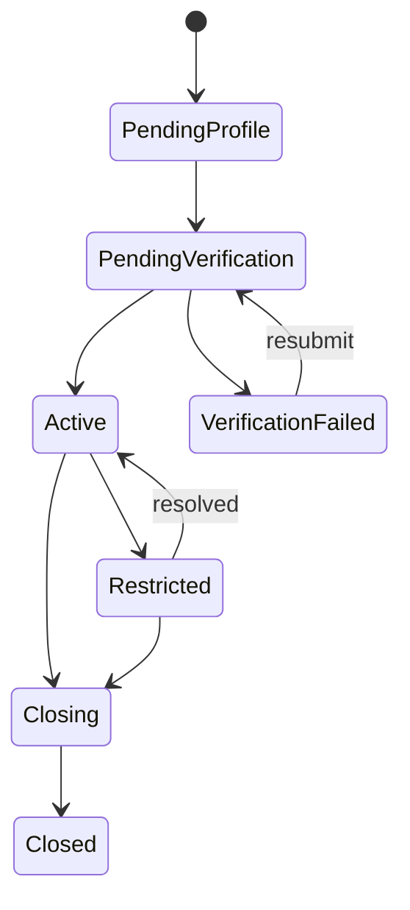

# Phase 02 — Customer lifecycle, KYC simulation, consent, and privacy controls

## Outcome

Build a privacy-aware customer domain with synthetic identity verification, tiered capabilities, contact and profile security, restrictions, consent/version evidence, retention rules, and data-right request foundations.

## Why this phase is high-signal

A credible fintech system does not treat onboarding as a form and a boolean `verified`. Identity evidence changes, providers return uncertain outcomes, risk restrictions overlap with KYC tiers, and privacy obligations constrain what can be collected, retained, exposed, and deleted.

## Dependencies

Phase 01.

## Customer model

### Customer states

KYC state is separate from account lifecycle. A customer can be active but restricted, or verified at a lower tier.

### KYC case states

`not_started -> collecting -> submitted -> provider_pending -> review_required -> approved | rejected | expired`.

No transition overwrites provider evidence or analyst decision history.

## Functional requirements

### Profile and contact points

- `CUS-001` Customer profile uses synthetic name, date-of-birth, address, and identifiers in all environments.
- `CUS-002` Email and phone are separate contact-point resources with verified status and change history.
- `CUS-003` Contact change requires step-up and delayed high-risk action policy.
- `CUS-004` Normalize for comparison while preserving original user-entered representation where necessary.
- `CUS-005` Prevent account enumeration and contact takeover through change/recovery flows.

### KYC simulation

- `KYC-001` KYC provider is a simulator with deterministic scenario IDs.
- `KYC-002` Store provider reference, submitted field hashes, decision, reason codes, assurance level, timestamps, and minimal evidence metadata.
- `KYC-003` Do not store real document images or biometric templates.
- `KYC-004` KYC tier controls permitted currencies, balance ceilings, transfer limits, beneficiary capability, and merchant access.
- `KYC-005` Provider callback is signed, replay checked, and matched to customer and case.
- `KYC-006` Manual review records factors, evidence references, reviewer, reason, and decision.
- `KYC-007` KYC expiry or downgrade triggers explicit account and risk effects; it does not silently delete balances.
- `KYC-008` Duplicate identity/reference scenarios create a review case rather than automatic merge.

### Consent and notice evidence

- `PRV-010` Privacy notice and terms have immutable versions and effective dates.
- `PRV-011` Record presentation, acceptance where applicable, locale, channel, version, and timestamp.
- `PRV-012` Consent is not used as a generic lawful basis for mandatory processing.
- `PRV-013` Optional communications preferences are granular and withdrawable.
- `PRV-014` Withdrawal does not erase historical evidence of prior consent.

### Data inventory and retention

- `PRV-020` Every customer field maps to purpose, classification, source, owner, retention, masking, and export behaviour.
- `PRV-021` Free-text notes cannot contain unrestricted KYC data; UI warns and server applies detection/redaction policy.
- `PRV-022` Synthetic evidence objects have checksums, retention metadata, and access logs.
- `PRV-023` Create retention jobs in dry-run mode before deletion mode.

### Restrictions

- `CUS-030` Restriction has type, scope, source, reason code, effective time, expiry, status, creator, and review path.
- `CUS-031` Multiple restrictions compose deterministically; removing one does not remove others.
- `CUS-032` Restrictions are checked at command time, not inferred from UI.
- `CUS-033` Restriction changes are audited and may require approval.

## API surface

- `GET /v1/customers/{customer_id}`
- `PATCH /v1/customers/{customer_id}` with ETag/version
- `GET /v1/customers/{customer_id}/contact-points`
- `POST /v1/customers/{customer_id}/contact-change-requests`
- `GET /v1/kyc/cases/{case_id}`
- `POST /v1/kyc/cases`
- `POST /v1/kyc/cases/{case_id}/submissions`
- `POST /v1/kyc/cases/{case_id}/decisions` workforce only
- `GET /v1/privacy/notices/current`
- `POST /v1/privacy/acknowledgements`
- `GET /v1/customers/{customer_id}/restrictions`
- `POST /v1/customers/{customer_id}/restriction-requests`

## Frontend requirements

### Customer onboarding

- Progressive, resumable flow.
- Clear reason for each requested field.
- Verification states distinguish “submitted,” “provider pending,” “needs your action,” “under review,” and “rejected.”
- Rejection copy uses safe, supportable reason groups and does not expose fraud controls.
- Capability page shows current tier and limits.
- Contact change warns about temporary transfer restrictions.
- Privacy notice supports version link and accessible reading experience.

### Workforce review

- Side-by-side current and submitted profile fields.
- Evidence references, not unrestricted raw documents.
- Decision reason and required notes.
- Conflict/duplicate indicators.
- Field masking by role.
- No silent override of provider result; manual outcome is a new decision record.

## Security and privacy threats

- mass assignment updates hidden KYC fields;
- IDOR on KYC case/evidence;
- provider callback replay;
- duplicate identity evasion;
- support user downloads evidence without purpose;
- malicious file content or content-type confusion;
- free-text note data leakage;
- account takeover through contact change;
- automated denial without review path;
- deletion removing financial audit linkage.

## Tests most agents will skip

1. Unknown JSON field attempts to set `kyc_tier` or `restriction_status` are rejected.
2. KYC callback arrives before submission response; state remains valid.
3. Same provider callback event is delivered repeatedly with altered whitespace and identical signed raw bytes rules.
4. Provider sends approved after case was manually rejected; invalid transition is recorded, not applied.
5. Customer changes email while a payout step-up is active; old session cannot complete action without re-evaluation.
6. Two concurrent restriction removals cannot clear an unrelated restriction.
7. Unicode normalization and whitespace do not cause duplicate-identity bypass.
8. Evidence download URL expires and cannot be reused after authorization is revoked.
9. Retention dry run produces deterministic object list; deletion preserves journal references.
10. CSV/JSON data export excludes other people’s data from shared transaction metadata.
11. Stored XSS payload in a review note is rendered inert in every workforce view and export.
12. KYC tier downgrade races with transfer initiation; command observes one coherent policy state.
13. Account closure with active hold and open review is blocked with precise prerequisites.
14. Privacy notice version changes while onboarding tab is stale; server requires current applicable acknowledgement.
15. Automated decision explanation uses stored policy/factors, not recomputation against current rules.

## Observability and runbooks

Metrics:

- KYC cases by state and age;
- callback signature failures and duplicates;
- manual review duration;
- contact changes and temporary restrictions;
- evidence access by role;
- retention dry-run/delete counts;
- data-right request age.

Runbooks:

- provider callback mismatch;
- suspected identity duplicate;
- contact takeover;
- accidental sensitive-data upload;
- privacy request;
- KYC provider outage;
- restriction correction.

## Acceptance gate

A reviewer can complete synthetic onboarding, trigger deterministic provider outcomes, review a case, apply overlapping restrictions, attempt a mass-assignment attack, change a contact point under step-up, inspect consent/version evidence, and run a retention dry run without damaging financial references.

## X content pillars

### Pillar A — “KYC is a state machine, not a verified boolean”

- Publish the state diagram.
- Demonstrate callback-before-response and late contradictory callback.
- Explain immutable decision history.

### Pillar B — “Privacy architecture changed my database design”

- Show field-to-purpose/retention matrix.
- Explain why event payloads do not carry entire customer objects.
- Demonstrate a data export and a safe closure/pseudonymisation flow.

### Pillar C — “Why removing one restriction must not unblock an account”

- Show overlapping restriction composition.
- Demonstrate concurrent removal test.
- Explain source, scope, expiry, and approval.

### Short-form posts

- A screenshot of the capability/limit explanation UI.
- “The five pieces of evidence I store instead of a real ID document.”
- “How a stale privacy notice tab becomes a correctness problem.”

## Do not waste time on

- OCR, facial recognition, liveness, or real identity-document collection;
- dozens of countries and document types;
- full AML screening vendor emulation;
- legal conclusions in code;
- decorative onboarding animation;
- a single `is_verified` flag.
