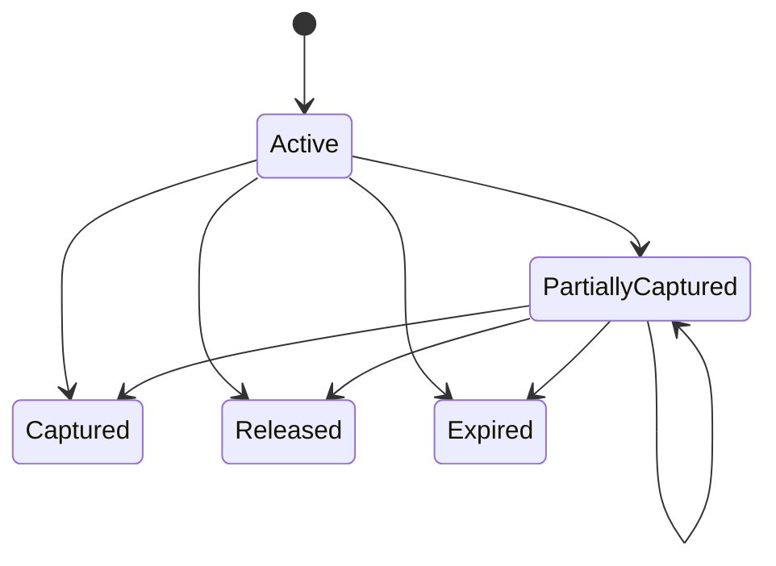

# Phase 04 — Wallets, balance projection, reservations, and holds

## Outcome

Create customer and merchant wallets backed by ledger accounts, expose precise balance semantics, and implement atomic holds, partial capture, release, expiry, and account lifecycle controls.

## Why this phase is high-signal

Double spending is prevented at the spendability boundary, not by a frontend disabled button. This phase connects accounting to product semantics and proves the system can reserve funds safely across asynchronous workflows.

## Dependencies

Phase 03. Customer ownership from Phase 02 is required for customer-facing wallets.

## Wallet model

A wallet is a product resource. Its financial backing is one or more ledger accounts. The initial implementation uses one spendable customer liability account per wallet and currency.

### Wallet states

`provisioning -> active -> restricted -> closing -> closed`.

A wallet may be active while a specific transaction type is restricted. State and restrictions are distinct.

### Hold states

Captured/released/expired are terminal. Expiry after partial capture releases only the remaining amount.

## Functional requirements

### Wallet creation and lifecycle

- `WAL-001` Wallet creation is idempotent per owner, product, and currency.
- `WAL-002` Creation provisions the correct ledger account template and returns only after durable completion or a resumable provisioning state.
- `WAL-003` Unsupported currency, duplicate product, ineligible KYC tier, or restricted customer is rejected with stable error.
- `WAL-004` Closing blocks new activity, requires zero available/posted balance according to product policy, no active holds, and no pending transactions.
- `WAL-005` Closed wallet cannot be reopened by ordinary operation; create a new wallet/reference if policy permits.

### Balance semantics

- `WAL-010` API returns `posted`, `held`, `available`, `currency`, `as_of`, and `version`.
- `WAL-011` Available balance is updated atomically with hold/posting changes.
- `WAL-012` No UI or API labels pending provider money as available.
- `WAL-013` Balance reads never use Redis as authority.
- `WAL-014` Negative available balance is impossible unless explicit overdraft product policy exists; Atlas default forbids it.

### Hold creation

- `HLD-001` Hold command requires purpose, amount, currency, expiry, idempotency, actor, and correlation.
- `HLD-002` Lock balance row, verify availability, create hold, update held/available projection, audit, and outbox atomically.
- `HLD-003` Hold cannot exceed available funds or product/transaction limits.
- `HLD-004` Duplicate purpose or idempotency key cannot reserve twice.
- `HLD-005` Expiry uses server clock abstraction and is safe under worker duplication.

### Capture and release

- `HLD-010` Capture amount cannot exceed remaining hold.
- `HLD-011` Capture and associated journal/business transition occur atomically.
- `HLD-012` Release only returns remaining amount to availability.
- `HLD-013` Capture/release is idempotent by command key and business reference.
- `HLD-014` Competing capture, release, and expiry operations serialize through version/row lock.
- `HLD-015` A business flow cannot capture a hold created for another purpose.

### Restrictions and freezes

- `WAL-020` Freeze affects new hold/posting templates according to explicit matrix.
- `WAL-021` Incoming credits may be allowed while outgoing activity is blocked; policy must be explicit.
- `WAL-022` Restriction/freeze changes are audited and may require approval.
- `WAL-023` Existing holds have defined treatment on freeze—preserve, release, or case review by restriction type.

## API surface

Customer:

- `GET /v1/wallets`
- `GET /v1/wallets/{wallet_id}`
- `GET /v1/wallets/{wallet_id}/balance`
- `GET /v1/wallets/{wallet_id}/activity`
- `POST /v1/wallets` where product permits self-provisioning
- `POST /v1/wallets/{wallet_id}/closure-requests`

Internal/privileged:

- `POST /v1/wallets/{wallet_id}/holds`
- `GET /v1/holds/{hold_id}`
- `POST /v1/holds/{hold_id}/captures`
- `POST /v1/holds/{hold_id}/releases`
- `POST /v1/wallets/{wallet_id}/restriction-requests`

## Frontend requirements

### Customer wallet

- Balance card separates available and held, with an explanation drawer.
- Activity timeline distinguishes reservation, pending external action, posted transfer, release, reversal, and settlement-related information.
- Wallet restriction banner explains permitted actions and support path without exposing internal risk logic.
- Closure flow lists blockers and never implies immediate deletion of financial history.
- Amount formatting never converts API minor-unit string through unsafe JavaScript number for large values.

### Operations wallet view

- Show ledger account link, balance version, active holds, pending transactions, restrictions, and first divergence if verification alert exists.
- Hold detail shows purpose, remaining amount, expiry, captures/releases, actor, and correlation.
- No manual “edit balance” control.

## Tests most agents will skip

1. Two concurrent holds each see enough funds individually but together exceed balance; only one succeeds.
2. Same idempotency key with different amount returns conflict without changing held balance.
3. Worker expires hold while transfer captures it; exactly one terminal allocation wins.
4. Partial capture followed by duplicate capture retry does not double-post.
5. Partial capture followed by expiry releases only remainder.
6. Release arrives after full capture and becomes safe no-op/conflict according to contract.
7. Wallet freeze occurs after hold but before capture; policy outcome is deterministic.
8. Customer closes wallet while active hold exists; closure remains blocked even if browser cache says zero held.
9. Projection rebuild from holds and ledger equals API balance after random operation sequences.
10. Large amount exceeds JavaScript safe integer but displays and round-trips correctly.
11. Stale `version` in operations view cannot overwrite restriction state.
12. Clock jumps forward/backward in test clock; expiry remains deterministic and monotonic policy is documented.
13. Active hold points to deleted/nonexistent business purpose in corruption fixture; verifier raises incident.
14. Redis unavailable; balance and hold correctness remain intact, with only rate-limit/cache degradation.
15. Incoming credit during outbound freeze follows matrix and is visible correctly.

## Observability and alerts

Metrics:

- wallets by state/currency;
- balance read latency;
- hold create/capture/release/expiry counts;
- insufficient funds denials;
- hold age and overdue active holds;
- balance lock wait and serialization retries;
- closure blockers;
- projection variance.

Alerts:

- overdue hold beyond grace period;
- negative available balance;
- hold remaining amount inconsistency;
- wallet/ledger ownership mismatch;
- large spike in insufficient-funds or hold conflicts.

## Acceptance gate

A reviewer can provision wallets, explain posted/held/available values, race two holds, partially capture and expire a hold, freeze a wallet, attempt closure with blockers, inspect the journal and hold timeline, and rebuild the projection with zero variance.

## X content pillars

### Pillar A — “Pending balance, ledger balance, and available balance are not synonyms”

- Use one wallet example.
- Show ledger postings and off-ledger reservation.
- Explain why the API returns all three values.

### Pillar B — “The double-spend bug lives between two innocent requests”

- Run the concurrent hold test live.
- Show the row lock/serializable behaviour.
- Verify final ledger and available balance.

### Pillar C — “A partial capture is where toy state machines break”

- Show hold state diagram.
- Capture part, expire remainder, retry callbacks.
- Publish the invariant `captured + released + remaining = original`.

### Short-form posts

- “Why Redis is not my wallet balance.”
- A customer-facing explanation of held funds and the backend model behind it.
- “There is no Edit Balance button in my operations console.”

## Do not waste time on

- many wallet themes or card-like animations;
- arbitrary user-created currencies;
- overdrafts or credit products;
- caching balance before correctness is measured;
- a mutable balance column disconnected from journal/holds;
- cron expiry without idempotent race handling.
