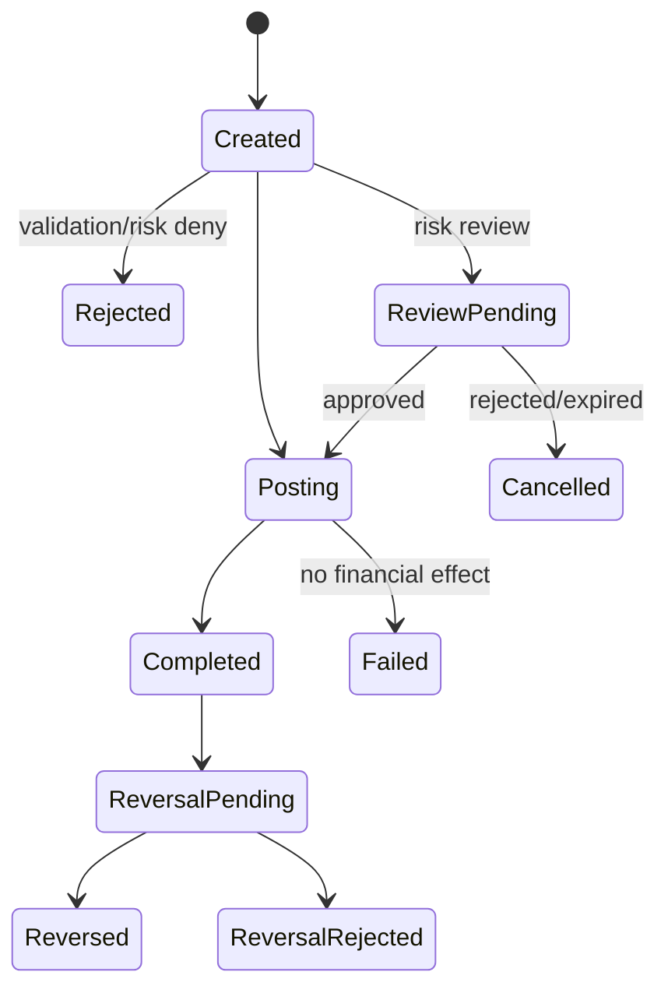

# Phase 06 — Internal wallet transfers

## Outcome

Implement atomic, idempotent transfers between Atlas wallets with recipient resolution, risk evaluation, holds where required, balanced ledger posting, precise lifecycle, notifications, reversals, disputes, and an end-to-end transaction inspector.

## Why this phase is high-signal

An internal book transfer is the cleanest place to prove the full money-movement contract without blaming an external provider. Every outcome should be explainable from one local transaction, and every retry/concurrency edge case should be reproducible.

## Dependencies

Phases 04 and 05, plus identity and customer controls.

## Transfer state model

For straight-through transfers:



The implementation may combine Created and Posting in one transaction, but the audit timeline must retain validation and risk decisions.

## Functional requirements

### Recipient resolution

- `ITR-001` Resolve recipient through a non-enumerable alias flow or explicit wallet identifier.
- `ITR-002` Return minimal confirmation data sufficient to prevent misdirection, with masking.
- `ITR-003` Recipient may not be source wallet.
- `ITR-004` Currency and wallet eligibility must match.
- `ITR-005` Alias changes and stale recipient confirmation are handled through a short-lived recipient token or server revalidation.

### Transfer creation

- `ITR-010` Require idempotency key, source wallet, recipient token/reference, amount, currency, optional customer-safe narration, and confirmation context.
- `ITR-011` Reject zero, negative, malformed, unsupported, or above-policy amount.
- `ITR-012` Normalize narration and prevent sensitive/security-control data or active content.
- `ITR-013` Step-up or confirmation is required according to risk and amount.
- `ITR-014` Authorization, recipient revalidation, risk/limit reservation, balance/hold, journal, transfer status, audit, notification outbox, and idempotent response commit coherently.
- `ITR-015` Completion references exactly one accounting journal.

### Accounting

Debit source customer liability and credit destination customer liability for the same currency and amount.

Any fee is a separate explicit posting line/template and is disclosed before confirmation.

### Review path

- `ITR-020` Reviewable transfer reserves funds or does not reserve according to policy; behaviour is explicit and customer-visible.
- `ITR-021` Approval rechecks source restriction, available hold, recipient status, and policy constraints.
- `ITR-022` Review expiry releases reservations exactly once.
- `ITR-023` Reviewer cannot redirect recipient or change amount.

### Reversal and dispute

- `ITR-030` Ordinary customer cancellation is allowed only before durable posting, if such a state exists.
- `ITR-031` Completed transfer reversal is a privileged compensating workflow, not row status editing.
- `ITR-032` Reversal requires reason, eligibility, recipient balance/negative policy, approval, and audit.
- `ITR-033` If recipient funds are unavailable, create case/resolution path rather than silently forcing negative balance.
- `ITR-034` Customer dispute creates a case linked to transaction; it does not automatically reverse money.

### Timeline

- `ITR-040` Every transfer exposes a safe customer timeline and a detailed workforce timeline.
- `ITR-041` Timeline derives from durable events/audit records and financial references, not ephemeral logs.
- `ITR-042` Workforce timeline links risk decision, hold, journal, notifications, approvals, and reversal.

## API surface

Customer:

- `POST /v1/recipient-resolutions`
- `POST /v1/transfers`
- `GET /v1/transfers/{transfer_id}`
- `GET /v1/transfers`
- `POST /v1/transfers/{transfer_id}/disputes`

Workforce:

- `GET /v1/operations/transfers/{transfer_id}`
- `POST /v1/operations/transfers/{transfer_id}/reversal-requests`

Example create payload:

```json
{
  "source_wallet_id": "wlt_...",
  "recipient_token": "rct_...",
  "money": { "amount_minor": "1000000", "currency": "NGN" },
  "narration": "Synthetic rent share"
}
```

## Frontend requirements

### Customer transfer composer

- Select source wallet and show available, not merely posted, balance.
- Resolve recipient and show masked confirmation.
- Display amount, fee, total debit, recipient credit, and timing before confirmation.
- Prevent accidental repeated click, but server idempotency remains authoritative.
- Step-up returns to an immutable confirmation snapshot.
- Success screen says “completed” only after posting; review state says review.
- Receipt includes transfer reference, time, parties masked, amount, fee, status, and support/dispute link.

### Transaction inspector

The standout portfolio surface:

```text
Request received
→ identity/session assurance
→ authorization decision
→ recipient resolution
→ risk policy version and factors
→ limit reservation
→ balance/hold action
→ journal posting and postings
→ domain event/outbox
→ notification
→ dispute/reversal events
```

Customer sees safe explanations. Workforce sees internal identifiers and evidence according to role.

## Tests most agents will skip

1. Two concurrent transfers spend the same final available funds; one fails safely.
2. Same idempotency key and body sent concurrently from two API replicas yields one transfer/journal.
3. Same key with different narration/amount returns conflict.
4. Commit succeeds but client connection closes before response; retry returns original receipt.
5. Recipient alias changes after preview but before submit; recipient token expiry/revalidation prevents misdirection.
6. Source and destination are same account through different aliases; rejected.
7. Transfer between wallets with visually similar Unicode aliases resolves by opaque token, not display text.
8. Risk review expires simultaneously with analyst approval; one terminal transition wins and funds are correct.
9. Notification event duplicates; one user-visible notification or deduplicated presentation.
10. Reversal request races with another outgoing transfer from recipient; no hidden negative balance.
11. Reversal event duplicates after restore; one compensating journal.
12. Free-text narration contains CSV formula, HTML, ANSI/log control characters, and oversized Unicode; safe in UI, export, and logs.
13. Pagination during active transfers does not duplicate/skip stable ordered entries.
14. Cross-tenant workforce lookup with valid transfer ID is denied and audited.
15. Trial balance and both wallet projections remain correct after random transfer/reversal sequences.
16. Customer dispute submitted twice creates one logical case.

## Observability and alerts

Metrics:

- transfer acceptance/completion/review/denial;
- p95/p99 posting latency;
- insufficient funds and limit conflicts;
- idempotency replays/conflicts;
- risk review age;
- reversal volume and failures;
- notification lag;
- end-to-end trace completion.

Alerts:

- accepted internal transfer not completed within tight local threshold;
- transfer without journal reference;
- journal without business transfer reference for transfer template;
- rising idempotency conflicts;
- reversal imbalance or stuck reversal.

## Acceptance gate

A reviewer can preview and complete a transfer, inspect every decision and posting, race duplicate and concurrent submissions, simulate response loss, trigger review, dispute it, request a reversal, and prove that balance and journal invariants hold.

## X content pillars

### Pillar A — “The transfer success toast is the least interesting part”

Walk through the transaction inspector from browser to journal and outbox.

### Pillar B — “Exactly-once is a business invariant, not a broker feature”

- Duplicate requests from two replicas.
- Unique idempotency record and journal reference.
- Duplicate notification tolerated separately.

### Pillar C — “Recipient preview can create a money-redirection bug”

- Alias resolution token.
- Stale preview test.
- Masked confirmation UX.

### Pillar D — “A reversal is a new transfer through the books”

- Show original journal and compensating journal.
- Demonstrate insufficient recipient funds and case path.

## Do not waste time on

- confetti or social payment feeds;
- arbitrary chat/messaging;
- QR payment UI before core transfer security;
- instant reversal button;
- “pending” status without timeout/owner;
- using notification delivery as transaction truth.
