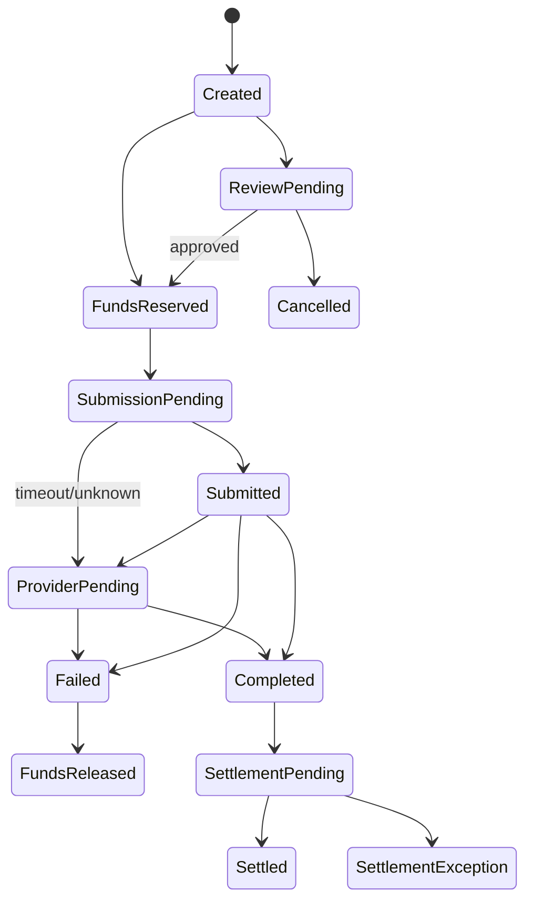

# Phase 07 — External money movement and provider adapters

## Outcome

Implement simulated bank cash-in and payout orchestration with provider adapters, durable attempts, safe retries, signed callbacks, ambiguity recovery, fees, holds, clearing accounts, provider polling, and operational control.

## Why this phase is high-signal

External providers turn simple state changes into distributed systems problems. Timeouts do not mean failure, callbacks may arrive before responses, providers may duplicate or contradict events, and financial posting may occur at authorization, acceptance, completion, or settlement depending on the rail. This phase makes those uncertainties explicit.

## Dependencies

Phase 06 and provider simulator foundation.

## Provider abstraction

```go
type Provider interface {
    CreatePayout(ctx context.Context, req PayoutRequest) (PayoutResponse, error)
    GetPayout(ctx context.Context, reference string) (PayoutStatus, error)
    ValidateCallback(headers http.Header, rawBody []byte) (ProviderEvent, error)
    ParseSettlement(ctx context.Context, object ObjectRef) ([]SettlementRecord, error)
}
```

Adapters normalize provider-specific status and errors but preserve raw evidence references.

## Provider simulator scenarios

Every request may select or derive a scenario:

- immediate success;
- immediate definitive failure;
- timeout before acceptance;
- timeout after acceptance;
- delayed callback;
- callback before synchronous response;
- duplicate callbacks;
- out-of-order callbacks;
- malformed callback;
- mismatched amount/currency/reference;
- success followed by invalid failure;
- provider record available by polling but callback absent;
- settlement omission, duplication, or amount mismatch.

## External payout state model



The exact rail may post customer debit at provider acceptance or completion. The accounting policy must be documented and consistent.

## Functional requirements

### Beneficiaries

- `EXT-001` Beneficiary is a versioned resource with account destination, bank/provider routing metadata, verification status, display mask, owner, and activation time.
- `EXT-002` Creation and activation require step-up and risk evaluation.
- `EXT-003` Newly activated beneficiary may have cooldown/limits.
- `EXT-004` Sensitive destination fields are encrypted and masked.
- `EXT-005` Changes create a new version or re-verification; in-flight transfers retain the confirmed snapshot.

### Payout acceptance

- `EXT-010` Validate wallet, amount, fee, beneficiary snapshot, risk, limits, step-up, and available funds.
- `EXT-011` Create transfer, reserve total debit, audit, and outbox atomically.
- `EXT-012` Return durable accepted state; do not block browser on provider call.
- `EXT-013` Provider request uses separate stable provider idempotency key and attempt reference.
- `EXT-014` Every attempt stores request checksum, scenario/provider, normalized result, raw evidence reference, timings, and correlation.

### Ambiguous outcomes

- `EXT-020` Timeout or transport failure is classified as pre-send, known reject, or unknown outcome when possible.
- `EXT-021` Unknown outcome never triggers blind provider failover.
- `EXT-022` Query provider by idempotency/reference before retry.
- `EXT-023` While ambiguous, customer funds remain reserved and status explains pending confirmation.
- `EXT-024` Watchdog escalates aged ambiguity to operations.
- `EXT-025` Manual resolution requires evidence and approval; it cannot directly edit financial state.

### Callback processing

- `EXT-030` Authenticate exact raw body, timestamp, key ID, and event ID.
- `EXT-031` Persist callback receipt before or with processing state.
- `EXT-032` Match provider, external reference, destination, amount, and currency.
- `EXT-033` Apply only allowed state transitions; duplicate/stale/contradictory events are recorded.
- `EXT-034` Completion captures hold and posts journal exactly once.
- `EXT-035` Definitive failure releases hold exactly once.

### Cash-in

- `EXT-040` Generate synthetic virtual account/reference or deposit instruction.
- `EXT-041` Provider simulator emits inbound credit event.
- `EXT-042` Validate unique provider transaction, amount, currency, destination reference, and payer metadata policy.
- `EXT-043` Credit customer liability against provider receivable/clearing.
- `EXT-044` Unknown or mismatched credits go to controlled suspense/review, never silently discarded.
- `EXT-045` Settlement later moves receivable to settlement-bank asset.

### Fees

- `EXT-050` Quote fee before confirmation.
- `EXT-051` Fee policy version and breakdown are stored.
- `EXT-052` Fee revenue and provider expense are separate accounts.
- `EXT-053` Refund/reversal treatment of fees is explicit.

## API surface

Beneficiaries:

- `POST /v1/beneficiaries`
- `GET /v1/beneficiaries`
- `GET /v1/beneficiaries/{beneficiary_id}`
- `POST /v1/beneficiaries/{beneficiary_id}/activation-requests`
- `PATCH /v1/beneficiaries/{beneficiary_id}`

Transfers:

- `POST /v1/external-transfers/quotes`
- `POST /v1/external-transfers`
- `GET /v1/external-transfers/{transfer_id}`
- `GET /v1/external-transfers`

Cash-in:

- `POST /v1/funding-instructions`
- `GET /v1/funding-instructions/{instruction_id}`

Provider callback:

- `POST /callbacks/providers/{provider}/events`

Workforce:

- `GET /v1/operations/provider-attempts/{attempt_id}`
- `POST /v1/operations/external-transfers/{transfer_id}/resolution-requests`

## Frontend requirements

### Customer payout

- Beneficiary creation is separate from payment confirmation.
- Confirmation locks beneficiary version, amount, fee, total debit, expected timing, and risk/step-up context.
- Pending provider confirmation copy explicitly says the request may already be processing and should not be resubmitted.
- Timeline distinguishes reserved, submitted, provider pending, completed, settlement pending, failed/released.
- Receipt shows provider reference only when safe.

### Operations transaction inspector

- Raw evidence is access-controlled and separate from normalized view.
- Show each attempt, idempotency key hash, request checksum, response, callbacks, polls, state transition decisions, hold, journal, and reconciliation link.
- Provide safe “query provider now” action, not arbitrary status edit.
- Manual resolution request requires reason, evidence, expected accounting action, and approval.

## Tests most agents will skip

1. Provider times out after accepting; retry queries and finds original operation without second payout.
2. Callback arrives before synchronous provider response; state remains monotonic.
3. Duplicate callback is processed by two worker replicas; one journal/capture.
4. Failure callback arrives after completion; recorded as contradictory, no fund release.
5. Callback signature valid but amount/currency/reference mismatched; quarantine and alert.
6. Provider key rotates while delayed callback uses prior valid key in grace window.
7. Provider polling says success while callback says failure; conflict policy creates case.
8. Worker crashes after provider accepts but before attempt update; watchdog recovers through stable provider reference.
9. Hold expires unexpectedly while provider outcome remains ambiguous; expiry policy prevents releasing potentially spent funds.
10. Beneficiary changes after confirmation; in-flight transfer uses immutable snapshot.
11. Beneficiary destination encryption key rotates; old records remain decryptable through key version.
12. Cash-in event duplicated, reordered, or sent with unknown destination; one credit or suspense item.
13. Provider response body is huge, compressed bomb, malformed JSON, wrong content type, or slow-drip; bounded safely.
14. Provider callback contains log-control characters and nested unknown fields; safe handling.
15. Circuit breaker opens during ambiguity; does not incorrectly mark transfers failed.
16. Restore database before callback processing; replay remains idempotent.
17. Fee policy changes between quote and confirmation; expired quote cannot silently reprice.
18. Negative/overflow provider amount is rejected before normalization.

## Observability and alerts

Metrics:

- provider attempts/outcomes/latency;
- ambiguous outcomes by age;
- callbacks received, duplicates, stale, contradictory, signature failures;
- provider polls and recovery success;
- hold age for external transfers;
- cash-in suspense volume;
- fee quote expiry;
- circuit-breaker state.

Alerts:

- aged ambiguous payout;
- callback mismatch/signature surge;
- provider success without local completion past threshold;
- local completion without provider evidence;
- hold at risk of expiry while ambiguous;
- suspense growth;
- provider degradation.

## Acceptance gate

A reviewer can select simulator scenarios, create a payout, witness timeout-after-acceptance, recover by provider query, process duplicate/out-of-order callbacks, inspect one captured hold and journal, receive a synthetic cash-in, route a mismatch to suspense, and view all evidence in the operations timeline.

## X content pillars

### Pillar A — “A timeout does not mean a payment failed”

- Demonstrate provider accepted then API timed out.
- Explain unknown outcome state.
- Query by provider idempotency key.
- Prove no duplicate debit.

### Pillar B — “I built a hostile payment provider on purpose”

- Show simulator scenario matrix.
- Duplicate, reorder, delay, and contradict callbacks.
- Explain why deterministic simulators beat happy-path mocks.

### Pillar C — “Why failover can double-charge a customer”

- Show Provider A unknown outcome.
- Explain why Atlas does not route to Provider B blindly.
- Document safe recovery criteria.

### Pillar D — “Raw provider evidence and normalized state are different data”

- Show checksummed raw payload reference.
- Show normalization and transition decision.
- Explain access controls and privacy.

## Do not waste time on

- real bank integration or live credentials;
- many providers before one simulator covers hard failures;
- automatic multi-provider routing;
- polling every second;
- generic `failed` for unknown outcome;
- calling provider inside ledger transaction;
- exposing raw provider messages to customers.
