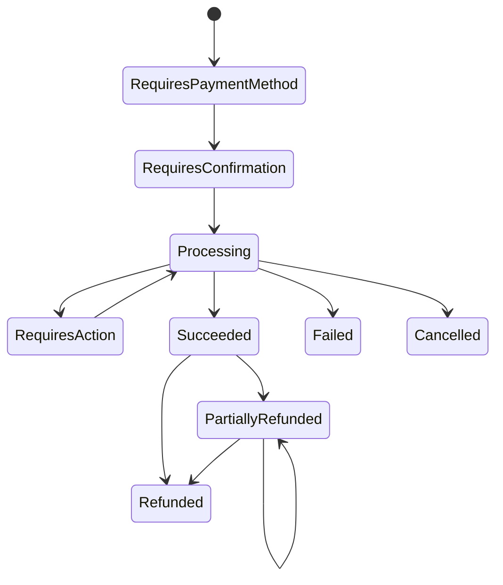

# Phase 08 — Merchant payments, credentials, refunds, and webhooks

## Outcome

Build a secure merchant platform with scoped machine credentials, payment intents, attempts, capture semantics, partial/full refunds, public event retrieval, signed webhooks, retry/replay tooling, endpoint safety, and merchant operations UX.

## Why this phase is high-signal

This phase shows developer-platform thinking, public API design, credential lifecycle, request and webhook authentication, SSRF defense, idempotency, compatibility, merchant operations, and financial lifecycle modelling.

## Dependencies

Phases 01 and 07.

## Payment model

### Payment intent states

The exact flow may use an internal wallet or simulated provider. Payment intent is stable across attempts.

### Refund states

`created -> review_pending? -> processing -> succeeded | failed`; succeeded refund is immutable and references its own journal.

## Functional requirements

### Merchant credentials

- `MER-001` Credentials are tenant/environment/scoped and named.
- `MER-002` Secret is shown once and is rotatable with overlap.
- `MER-003` Request authentication uses OAuth client credentials or a documented HMAC/asymmetric signing profile.
- `MER-004` Signed requests include key ID, timestamp, nonce/request ID, method, canonical target, body digest, and signature.
- `MER-005` Clock skew and replay window are bounded.
- `MER-006` Permissions distinguish payment create/read, refund create/read, webhook manage/replay, settlement read, and report export.

### Payment intents

- `PAY-001` Create requires merchant reference, amount, currency, capture method, expiry, metadata allowlist, and idempotency.
- `PAY-002` Merchant reference uniqueness is scoped and documented.
- `PAY-003` Amount/currency become immutable after processing begins.
- `PAY-004` Attempts are separate records with provider/internal method, external reference, and evidence.
- `PAY-005` Status is derived from valid state transitions, not directly set by merchant.
- `PAY-006` Merchant can retrieve truth after webhook loss.
- `PAY-007` Metadata is size-limited, safe, and never trusted for authorization or accounting.

### Capture

- `PAY-010` Automatic capture posts immediately on successful payment according to rail.
- `PAY-011` Manual capture reserves/authorizes and has expiry, partial-capture policy, and remaining amount semantics.
- `PAY-012` Capture command is idempotent and concurrency-safe.
- `PAY-013` Captured total cannot exceed authorized/intent amount.
- `PAY-014` Cancellation releases remaining authorization exactly once.

### Refunds

- `RFD-001` Refund is a resource with merchant reference, amount, reason, original payment, and idempotency.
- `RFD-002` Aggregate successful/in-flight refund amount cannot exceed refundable amount.
- `RFD-003` Concurrent partial refunds serialize safely.
- `RFD-004` Fee-refund policy is explicit and visible.
- `RFD-005` Refund completion posts compensating journal and emits webhook exactly once as a business effect.
- `RFD-006` Failed/ambiguous external refund follows provider recovery model.

### Webhook endpoints

- `WHK-001` Endpoint scheme is HTTPS except explicit local-development mode.
- `WHK-002` Validate and continuously enforce no private, loopback, link-local, metadata-service, or disallowed destination.
- `WHK-003` DNS rebinding, redirects, proxy environment variables, and IPv6 literals are handled safely.
- `WHK-004` Endpoint has subscribed event types, status, secret/key version, failure policy, and metadata.
- `WHK-005` Verification handshake proves endpoint control before activation.
- `WHK-006` Disable endpoint after policy threshold while preserving events for retrieval/replay.

### Delivery

- `WHK-010` Event ID is stable; each delivery attempt has unique ID.
- `WHK-011` Sign exact body with timestamp, event ID, key ID, and version.
- `WHK-012` Retry only network/timeout and configured status classes with bounded schedule.
- `WHK-013` Delivery response body and headers are bounded and redacted.
- `WHK-014` Replay creates a new delivery attempt for the same event and is audited.
- `WHK-015` Ordering is not guaranteed unless explicitly provided per endpoint/subject; docs teach idempotent consumers.
- `WHK-016` Merchant can list events and deliveries independently of webhook reception.

## API surface

Public merchant API:

- `POST /v1/payment-intents`
- `GET /v1/payment-intents/{payment_intent_id}`
- `GET /v1/payment-intents`
- `POST /v1/payment-intents/{payment_intent_id}/confirmations`
- `POST /v1/payment-intents/{payment_intent_id}/captures`
- `POST /v1/payment-intents/{payment_intent_id}/cancellations`
- `POST /v1/refunds`
- `GET /v1/refunds/{refund_id}`
- `GET /v1/events`
- `GET /v1/events/{event_id}`

Merchant dashboard:

- `POST /v1/webhook-endpoints`
- `GET /v1/webhook-endpoints`
- `PATCH /v1/webhook-endpoints/{endpoint_id}`
- `POST /v1/webhook-endpoints/{endpoint_id}/rotations`
- `GET /v1/webhook-deliveries`
- `POST /v1/webhook-deliveries/{delivery_id}/replays`

## Frontend requirements

### Developer portal

- Human-readable API reference rendered from OpenAPI.
- Copyable examples and test credentials with environment banner.
- Idempotency and retry guide.
- Webhook verification examples in Go, TypeScript, and curl-style pseudocode.
- Changelog and breaking-change policy.
- Event catalog with sample payloads.

### Merchant dashboard

- Payment funnel and operational table with stable filters.
- Payment detail links intent, attempts, journal, refunds, events, and settlement.
- API credential creation/rotation.
- Webhook endpoint status, subscribed events, secret version, recent deliveries, attempt response, retry countdown, disable reason, and replay action.
- Refund composer shows refundable amount, in-flight refunds, fee treatment, and consequence.

### Checkout/demo surface

A minimal, accessible synthetic checkout can demonstrate payment lifecycle. Do not build a full commerce storefront.

## Tests most agents will skip

### API auth and contract

1. Canonical request signing handles query order, repeated headers, body whitespace, empty body, and Unicode path correctly.
2. Valid signature with stale timestamp or reused nonce is rejected.
3. Key rotation accepts both keys only during overlap and attributes use correctly.
4. Unknown JSON property attempts to set `status`, `captured_amount`, or tenant ID are rejected.
5. OpenAPI examples round-trip against live server and generated client.
6. Enum addition compatibility test ensures frontend does not crash on unknown status.

### Payment/refund concurrency

7. Two concurrent captures cannot exceed authorization.
8. Capture and cancel race; only one economic outcome.
9. Multiple partial refunds race against remaining refundable amount.
10. Refund request times out after commit; retry returns original refund.
11. Refund provider callback duplicates/contradicts; one compensating journal.
12. Payment metadata contains HTML, CSV formula, very deep JSON, and huge values; bounded and safe.

### Webhook security

13. Endpoint resolves to public IP during validation then private IP during delivery; blocked.
14. DNS rebinding across A/AAAA records is handled.
15. Redirect chain reaches metadata service/private network; blocked.
16. URL contains credentials, unusual ports, IPv6 forms, decimal/octal IP, or mixed encoding; parser policy holds.
17. Endpoint returns infinite/huge response or slow-drips bytes; timeout/size limits work.
18. TLS certificate invalid/expired/name mismatch; no insecure fallback.
19. Merchant endpoint returns 2xx after timeout from Atlas perspective; duplicate retry is expected and docs show consumer idempotency.
20. Replay while original retry is active creates safe separate attempt, not duplicate event resource.
21. Webhook signing-key rotation while old deliveries retry preserves verifiability by key ID.
22. Signature verification test uses exact raw bytes and rejects parsed/re-serialized body assumptions.
23. Endpoint deletion does not erase historical delivery evidence.

## Observability and alerts

Metrics:

- API auth failures by safe category;
- idempotency replay/conflict;
- payment attempts and conversion;
- capture/refund latency and race conflicts;
- webhook delivery success by endpoint/status;
- retry lag, endpoint disablement, SSRF block decisions;
- credential age and last use;
- event retrieval after failed webhook.

Alerts:

- signature verification failure spike;
- credential use anomaly;
- excessive refund rate;
- high failed webhook endpoint concentration;
- SSRF attempts;
- payment succeeded without event/outbox;
- refundable amount variance.

## Acceptance gate

A reviewer can create a scoped credential, sign a request, create/confirm/capture a payment, race captures, issue concurrent partial refunds, register a webhook endpoint, see signed delivery, rotate keys, trigger SSRF protections, replay a delivery, and retrieve the same event through the API.

## X content pillars

### Pillar A — “A payment intent is not a provider charge”

- Show intent and multiple attempts.
- Explain stable merchant object versus provider volatility.
- Demonstrate retrieval after webhook loss.

### Pillar B — “Webhook delivery is an SSRF feature unless you design it not to be”

- Threat diagram.
- DNS rebinding/private IP tests.
- Redirect and timeout policy.
- Safe delivery trace.

### Pillar C — “Partial refunds are a race condition”

- Run concurrent refund test.
- Show locked refundable amount and one set of journals.

### Pillar D — “Signed webhooks still duplicate”

- Explain authentication versus delivery semantics.
- Demonstrate receiver idempotency and Atlas event retrieval.

## Do not waste time on

- a full e-commerce storefront;
- dozens of SDKs before one excellent API contract;
- GraphQL;
- custom TLS or signature algorithms;
- arbitrary merchant code in webhook transforms;
- webhook “exactly once” claims;
- storing card data.
