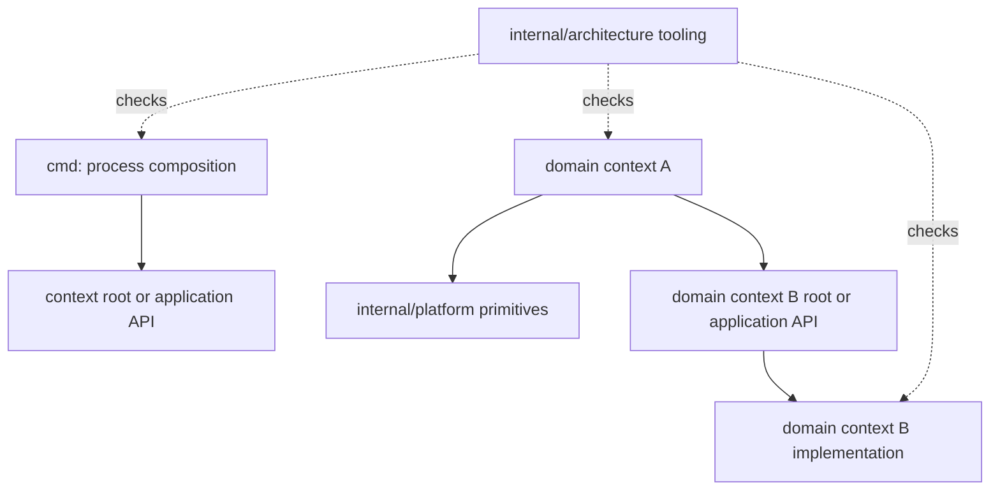

# Atlas module boundaries

This is the enforceable S01 dependency model for ADR 0001. Empty context directories indicate ownership only; they do not claim implemented capability.

Allowed direction:

- `cmd/<process>` may import a context root or its `application` API for composition.
- A domain context may import `internal/platform` and another context's root or `application` API.
- A domain context may freely organize packages below its own first-level directory.

Rejected direction:

- Cross-context imports of persistence, store, repository, database, SQL, or other private implementation packages.
- Imports from `internal/platform` or `internal/architecture` into domain contexts.
- Domain imports of architecture tooling.
- Shared domain dumping grounds named `internal/common`, `internal/shared`, or `internal/models`.
- Unregistered first-level `internal/*` modules or `cmd/*` process entry points; additions require an explicit ownership/checker update.

The checker parses Go imports using the standard library. `TestBoundaryCheckerRejectsForbiddenImport` creates an isolated source fixture that imports `github.com/MichaelSeveen/atlas/internal/ledger/persistence` from the transfer context and proves the checker reports it. `TestBoundaryCheckerRejectsUnregisteredModule` proves an undeclared `internal/debugtools` package cannot bypass the registry. Neither test adds violating source to the working tree.

Database write ownership cannot be proved before PostgreSQL roles and schemas exist; that remains S05 under `FND-060` and is not claimed by S01.
