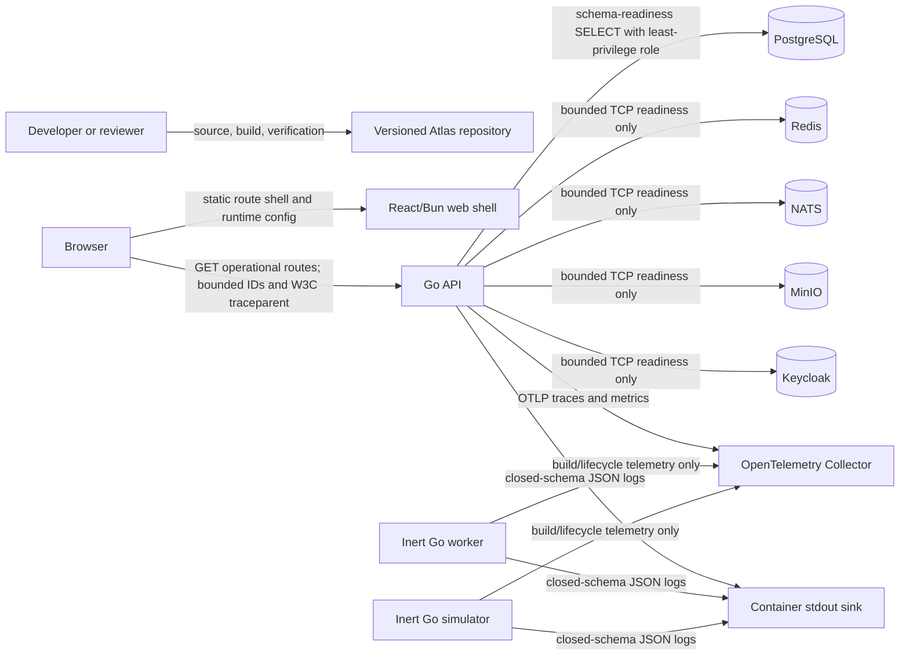

# Phase 00 system context and threat model

Status: S06 baseline, reviewed 2026-07-21. This model describes the secure-engineering foundation only. The canonical product, architecture, trust, and threat authorities remain `docs/atlas-prd/`.

## Scope and non-scope

In scope are the source repository, React/Bun build boundary, Go API/worker/simulator processes, local synthetic dependencies, PostgreSQL foundation schema, operational HTTP routes, configuration, structured logs, and OTLP traces/metrics. There is no customer identity exchange, product endpoint, wallet state, financial journal, broker stream, object, cache entry, provider call, or worker job in Phase 00.

## Context and current data flow

Telemetry is deliberately outside the readiness-critical path. Redis, NATS, MinIO, and Keycloak are probed for local topology readiness but carry no product data. The web shell does not proxy credentials or tokens. The collector does not receive application logs in S06; the processes emit source-redacted JSON to stdout because the OpenTelemetry Go log SDK remains outside this baseline.

## Trust boundaries

| Boundary | Untrusted side | Trusted side | Crossing and enforcement |
|---|---|---|---|
| TB-01 Browser/process | Browser-controlled HTTP metadata and timing | API process | Exact route/method inventory, body/header/time limits, exact-origin CORS, safe errors, strict opaque-ID and W3C trace validation |
| TB-02 Process/database | API process and network | PostgreSQL foundation schema | Dedicated API role, fixed parameterized readiness query, bounded pool and deadlines; no product write path |
| TB-03 Process/telemetry | Process telemetry queue and network | Collector/sink | Closed attribute allowlists, source redaction, bounded queues/timeouts, no readiness dependency |
| TB-04 Process/secret provider | Provider references/availability | In-process consumer callback | Environment/purpose/algorithm/version binding, minimum-version floor, grace overlap, revocation, short-lived copied material |
| TB-05 Repository/build | Third-party source and tooling | Revision-bound artifacts/evidence | Pinned toolchains/dependencies, static policy tests, verification scripts; S07 supply-chain gates remain pending |
| TB-06 Local/reference environments | Developer-controlled configuration | Synthetic Atlas topology | Strict schema, reserved hosts, environment-scoped references, synthetic-only flags and banners |

## Initial STRIDE analysis and trace links

`PHASE-00-THREAT-COVERAGE.json` is the executable source/control/test/owner/residual index for every canonical `THR-001..060` row. Its validator rejects missing, duplicate, unknown, owner-drifted, or unclassified links. The table below expands the immediate S06 boundary risks.

| STRIDE | Threat register source | Phase 00 scenario | Preventive/detective control | Reproducible S06 evidence | Residual position |
|---|---|---|---|---|---|
| Spoofing | THR-005, THR-020, THR-056 | Forged request context, wrong-purpose key, old algorithm/version | Strict opaque/W3C parsing; secret reference and policy binding; no identity semantics yet | `FuzzUntrustedRequestMetadata`; `TestVersionedRotationOverlapAndDowngradeRejection`; `TestSecretMaterialCannotCrossEnvironmentOrPurpose` | Identity authorization remains Phase 01 |
| Tampering | THR-013, THR-014, THR-040, THR-060 | Build/evidence drift or direct schema misuse | Revision metadata, migration manifest/roles, catalog validators, phase verification | S05 migration/role evidence; `TestMetricCatalogEnforcesCardinalityAndRuntimeCoverage`; S06 revision evidence | S07 CI/provenance and later financial controls remain pending |
| Repudiation | THR-019, THR-030, THR-060 | Missing or forgeable operational trail | JSON encoding, closed event schema, correlation/trace IDs, immutable evidence additions | `TestMostAgentsSkipStructuredLogInjection`; golden request trace; evidence digest | Actor/tenant/audit events do not exist yet |
| Information disclosure | THR-009, THR-020, THR-045 | Secret/PII enters logs, traces, errors, fixtures, or wrong environment | No free-form log fields; pseudonymous IDs; safe problems; synthetic-only configuration; material callback/wipe | sink canary and scan; `TestLogSchemaRejectsSensitiveAndUnboundedValuesAtSource`; S04 config tests | Product-field inventories must be added before each later domain |
| Denial of service | THR-010, THR-048, THR-049 | Unbounded request, pool, metric cardinality, exporter stall, or future retry loop | HTTP limits/deadlines; four-connection readiness pool; label budget; bounded exporter queue/timeouts; telemetry excluded from readiness | S03 slow/body tests; catalog test; `TestUnavailableCollectorDoesNotBlockRuntimeCreation`; live collector-outage check | Queue/retry/storage runtime metrics are definition-only until those subsystems exist |
| Elevation of privilege | THR-005, THR-040, THR-042 | Debug route or overprivileged database action bypasses intended boundary | Three-route inventory, static architecture bans, least-privilege database grants | `TestResourceLimitsRouteInventoryAndSafeProblems`; S05 database role tests | Server-side tenant/action/field authorization begins in Phase 01 |

THR-054 is intentionally not claimed as controlled: no domain state or outbox exists. The transactional-outbox ADR remains a future invariant. THR-048 metrics are also definition-only because the worker has no jobs. This is a scope boundary, not proof of completion.

## Review triggers

Update this model before adding an endpoint, event, worker job, identity exchange, database write, cache entry, object, provider call, new telemetry attribute, secret purpose, or external deployment boundary. Any new crossing must add its threat IDs, control owner, test, runbook, and residual risk before implementation is considered complete.
